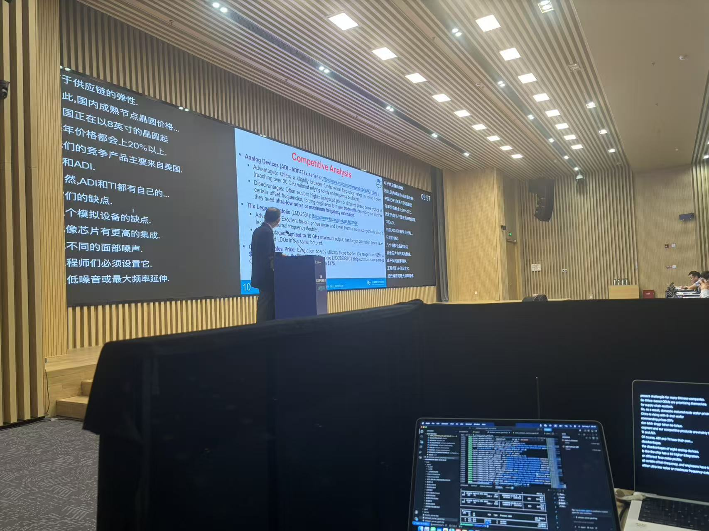
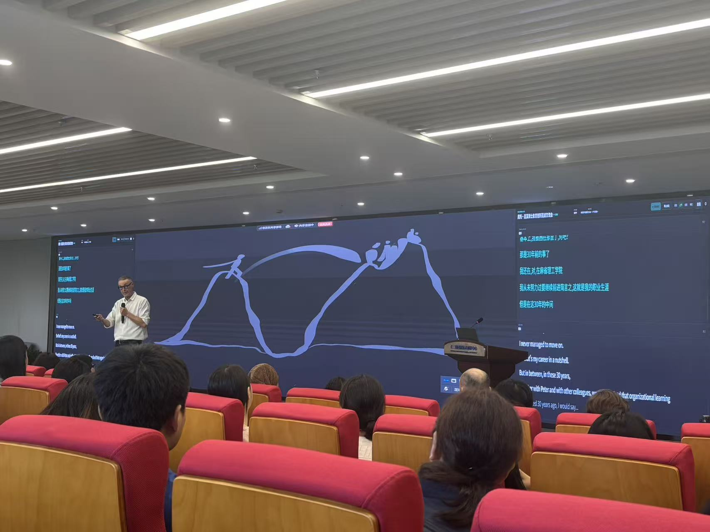
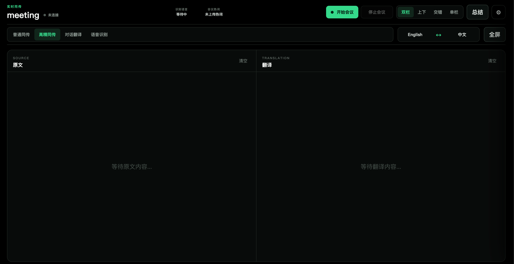

# WhisperLive - Real-time Simultaneous Interpretation Meeting System

> An all-in-one solution for browser-based real-time speech recognition, Chinese-English translation, meeting hotwords, meeting logs & post-meeting proofreading, and LLM-powered meeting summaries.

[English](README.md) | [中文](README.zh-CN.md)

## Features

- **Real-time speech recognition**: Faster-Whisper backend with batched GPU inference; multiple sessions share model instances.
- **Real-time Chinese-English translation**: NLLB / Helsinki models with automatic direction detection or explicit direction selection.
- **Meeting hotwords**: Upload UTF-8 text files from the browser, one hotword per line, with optional fixed translation mappings.
- **ASR correction rules**: Global and meeting-level correction tables for Whisper, using literal replacements with longest-match priority.
- **Meeting logs**: Appended per-session on the backend; exported as JSON / Markdown / DOCX.
- **Post-meeting proofreading**: Edit source text, merge speakers, revision conflict protection, and automatic invalidation of stale translations and summaries.
- **LLM meeting summaries**: Custom `.md` / `.docx` templates with full version history.
- **Extras**: Speaker diarization, Silero VAD silence filtering, auto-reconnect, Admin API and a browser-based admin console.

## Demo & Screenshots

Screenshots and the demo video live in `assets/screenshots/` and `assets/videos/`. Drop files in with the names below and this section updates automatically.

<div align="center">
  
  <br>
  <em>In-use at a live meeting</em>
</div>

<div align="center">
  
  <br>
  <em>In-use at a live meeting</em>
</div>

<div align="center">
  
  <br>
  <em>Web interface</em>
</div>

Demo video (stream on YouTube):

<a href="https://youtu.be/8paO3T7A038">
  
</a>

## Documentation

- [User Guide](./whisperlive-user-guide.md): business modes, meeting operations, display, hotwords, log proofreading and summaries.
- [Production Ops Guide](./whisperlive-ops-guide.md): 5090×2 production architecture, routing, GPU roles, startup, acceptance and troubleshooting.
- [Web Frontend](./web/README.md): local static pages and secure context.

This document covers the project structure, local development startup and backend feature reference. For production operations, follow the ops guide.

## Project Structure

```text
run_server.py                    Service entry point
whisper_live/server.py           WebSocket, Admin API and service orchestration
whisper_live/meeting/            Hotwords, logs, proofreading, templates and summaries
whisper_live/backend/            ASR and translation backends
whisper_live/batch_inference.py  Batched GPU inference
web/                             Browser frontend and admin console
scripts/                         Startup, model download and load-test scripts
deploy/                          Environment-specific Nginx config (git-ignored)
```

## Environment Overview

### Local machine: single RTX 3060

Local development uses a single Faster-Whisper backend by default:

- ASR runs on GPU0.
- Translation defaults to CPU to avoid competing with ASR for VRAM.
- Nginx entry point: `http://localhost:9093`.
- Only the `/ws-standard` business mode is validated by default. The accurate mode currently targets `cuda:1`, which a single-GPU container cannot satisfy, so do not use it directly.

### Production machine: 2× RTX 5090

Production role assignment:

| Endpoint | ASR | Translation |
| --- | --- | --- |
| `/ws-standard` | Load-balanced across two Faster-Whisper backends on GPU0 and GPU1 | CPU |
| `/ws-accurate` | Fixed to the GPU0 backend | Physical GPU1 |

Both ASR backends use `model/asr/large-v3-turbo`. Accurate interpretation prefers NLLB 3.3B; meeting summaries use `qwen3-32b-awq`.

`/ws`, `/ws-gpu0` and `/ws-gpu1` are compatibility and troubleshooting routes only. Regular users do not need to fill in routes or select GPUs; the frontend switches automatically based on the business mode.

See the [Production Ops Guide](./whisperlive-ops-guide.md) for deployment, shared log/Admin requirements and acceptance steps.

## 1. Quick Start (Local)

### 1.1 Prerequisites

- The `whisperlive-server:docx` image is built.
- The external Docker network `whisperlive-net` exists.
- `model/asr/large-v3-turbo` is available.
- `deploy/nginx/whisperlive.conf` is configured as the local entry point.

```bash
docker network create --subnet 172.30.0.0/24 whisperlive-net
docker compose -f docker-compose.local.yml up -d
```

Access:

```text
User page:      http://localhost:9093/
Admin console:  http://localhost:9093/admin.html
Direct Admin API: http://localhost:9094/admin/clients
```

`docker-compose.local.yml` starts `whisperlive-gpu0` and `whisperlive-web-gateway`. The project directory is mounted into the container via a volume, so code changes usually do not require rebuilding the image.

Stop:

```bash
docker compose -f docker-compose.local.yml down
```

## 2. Building Images

```bash
docker build --network=host -f docker/Dockerfile.server -t whisperlive-server:docx .
```

| Dockerfile | Purpose |
| --- | --- |
| `docker/Dockerfile.server` | Production GPU image with ASR, translation, summaries and DOCX |
| `docker/Dockerfile.gpu` | Slim GPU image |
| `docker/Dockerfile.cpu` | CPU-only image |
| `docker/Dockerfile.tensorrt` | TensorRT backend |
| `docker/Dockerfile.openvino` | OpenVINO backend |
| `docker/Dockerfile.client` | Static web frontend |

Do not commit models, logs, audio, exported files or image archives to Git.

## 3. Running Faster-Whisper Manually

Local container:

```bash
docker run --rm -it --gpus '"device=0"' \
  --name whisperlive-gpu0 \
  --network whisperlive-net \
  -p 9090:9090 -p 9094:8000 \
  -v "$PWD:/app" -w /app \
  whisperlive-server:docx bash
```

Inside the container, use the generic script:

```bash
ASR_DEVICE_INDEX=0 TRANSLATION_DEVICE=cpu ./scripts/start_whisper_service.sh
```

Equivalent core arguments:

```bash
python run_server.py \
  --port 9090 \
  --backend faster_whisper \
  --max_clients 12 \
  --max_connection_time 60000 \
  --batch_inference \
  --batch_max_size 1 \
  --asr_device_index 0 \
  --translation_device cpu \
  --rest_port 8000 \
  --meeting_hotwords_dir config/hotwords.d \
  --asr_corrections_dir config/asr_corrections.d \
  --asr_corrections_file config/asr_corrections.d/DOMAIN_CORRECTIONS.txt \
  --meeting_logs_dir logs \
  --cors-origins http://localhost:9093,http://127.0.0.1:9093 \
  -fw model/asr/large-v3-turbo
```

When adding new startup arguments, also check `run_server.py` and `TranscriptionServer.run()` in `whisper_live/server.py`.

### Starting the Web Gateway Manually

After the backend container is running, from the project root:

```bash
docker run --rm -it \
  --name whisperlive-web-gateway \
  --network whisperlive-net \
  --add-host=host.docker.internal:host-gateway \
  -p 9093:80 \
  -v "$PWD/web:/usr/share/nginx/html:ro" \
  -v "$PWD/deploy/nginx/whisperlive.conf:/etc/nginx/conf.d/default.conf:ro" \
  nginx:alpine
```

## 4. Optional FunASR Backend

FunASR remains supported but is not the current 5090×2 production path. Prepare:

```text
model/funasr/paraformer-zh-streaming
model/funasr/SenseVoiceSmall
model/funasr/ct-punc
model/vad/silero_vad.onnx
```

Run inside the container:

```bash
./scripts/start_funasr_service.sh
```

The script uses Paraformer streaming recognition and tries SenseVoice refinement after each sentence. On failure it falls back to the streaming text. For troubleshooting, search for `final refinement failed`, `CUDA out of memory` and `FUNASR_FINAL_REFINE`.

## 5. Browser Business Modes

| Mode | Route | Default translation |
| --- | --- | --- |
| Standard interpretation | `/ws-standard` | NLLB 600M, CPU |
| Accurate interpretation | `/ws-accurate` | Prefer NLLB 3.3B, `cuda:1` |
| Conversation translation | `/ws-standard` | Helsinki, CPU, adaptive Chinese-English |
| Speech recognition | `/ws-standard` | Translation off |

When the accurate model is unavailable, the frontend selects from 1.3B, 600M and Helsinki in that order. The actual list comes from `/admin/translation-models`.

The frontend also supports:

- Automatic direction detection or explicit translation direction.
- Two-column, stacked, interleaved and single-column layouts.
- Font size and color settings for source/translation.
- Fullscreen subtitles only.
- Speaker diarization.
- Auto-reconnect and meeting continuation after disconnects.

## 6. Meeting Hotwords

The browser accepts UTF-8 `.txt` or `.md` files with one hotword per line:

```text
WhisperLive
大模型
OpenAI => 开放人工智能
```

- Plain lines are used as ASR hotwords only.
- `source => target` adds both an ASR hotword and a fixed translation mapping.
- Fixed translations are one-way rules; the longest phrase wins when multiple rules match.
- The hotword snapshot is locked when the client starts a meeting; later changes only affect the next start.

The server hotword directory is set with `--meeting_hotwords_dir`. The admin console scans and previews server hotword files; it does not upload or delete them.

### Whisper ASR Correction Rules

ASR correction tables are supported for standard Chinese-to-English and bidirectional translation scenarios with Faster-Whisper. Corrections apply only to completed Chinese segments and are propagated to source subtitles, meeting logs and translation input; real-time partial subtitles, FunASR, English-to-Chinese and plain transcription are unaffected.

The global correction file is set with `--asr_corrections_file` and applies to all standard Chinese-to-English and bidirectional meetings. Meeting-level correction files live in the directory set with `--asr_corrections_dir` (default `config/asr_corrections.d`); the file name without `.txt` must match the meeting name:

```text
config/asr_corrections.d/DOMAIN_CORRECTIONS.txt
config/asr_corrections.d/产品例会.txt
```

Rules use literal replacements (no regular expressions):

```text
# Whisper misrecognition => correct text
威斯伯 => Whisper
派森 => Python
开放爱爱 => OpenAI
```

Rules are applied from longest to shortest misrecognition; duplicate keys use the last rule. Global rules load first, meeting rules load later, and meeting rules win for the same key. Corrections are disabled if the file is missing or empty.

## 7. Meeting Logs and Proofreading

At meeting start the frontend generates a `session_id` and start time; the backend appends ASR source text and translations per session. The export button downloads backend-generated files rather than rebuilding logs in the browser.

Post-meeting capabilities:

- Markdown, JSON and DOCX logs.
- DOCX layouts for source text and side-by-side Chinese-English.
- Edit source text while preserving `original_text`.
- Add, rename and merge speakers.
- Revision conflict protection.
- Mark old translations and summaries as stale after edits.

The log directory is set with `--meeting_logs_dir`. In dual-backend production, a single unified `/admin/` must reach all meeting data; see the ops guide for details.

## 8. Summaries and Custom Templates

The summary API defaults to `http://127.0.0.1:8001/v1`. The generic default model is `qwen3-4b-awq`; 5090×2 production explicitly uses `qwen3-32b-awq`.

`scripts/start_summary_llm_service.sh` defaults to Qwen3-4B-AWQ. Production 32B requires both:

```bash
SUMMARY_MODEL_PATH=model/LLM/Qwen3-32B-AWQ \
SUMMARY_MODEL_NAME=qwen3-32b-awq \
bash scripts/start_summary_llm_service.sh
```

Custom templates support `.md` and `.docx`; the flow is analyze template, confirm fields, save, select template and generate. Summaries keep version history; deleting a template does not delete existing summaries.

## 9. Admin API and Admin Console

The Admin API always runs on `--rest_port`; `--enable_rest` only controls the additional OpenAI-compatible REST ASR interface.

Main capabilities:

- Client status and force disconnect.
- ASR/translation model warm-up.
- Query available translation models.
- Server hotword listing and preview.
- Meeting logs, proofreading, speakers and summaries.
- Custom summary templates.

Enter only the base address in the admin console input, without appending `/admin/clients`.

## 10. Batched Inference, VAD and Diarization

Batched inference:

```bash
--batch_inference
--batch_max_size 8
--batch_window_ms 50
```

When enabled, multiple sessions share the model and a single BatchInferenceWorker. With `batch_max_size=1` scheduling degrades to one request at a time, but the model instance is still shared.

Silero VAD is enabled by default in the browser to reduce silence hallucinations. Diarization is enabled via the client `enable_diarization` config; results are written to meeting logs and can be proofread afterwards.

## 11. Startup Arguments Reference

| Argument | Default | Description |
| --- | --- | --- |
| `--port` | `9090` | WebSocket port |
| `--backend` | `faster_whisper` | ASR backend |
| `-fw` | none | Faster-Whisper model path |
| `--max_clients` | `4` | Maximum concurrent connections |
| `--max_connection_time` | `300` | Max connection time, seconds |
| `--batch_inference` | off | Enable batched inference |
| `--batch_max_size` | `8` | Maximum batch size |
| `--batch_window_ms` | `50` | Batch wait window, milliseconds |
| `--asr_device_index` | `0` | Faster-Whisper CUDA device index |
| `--translation_device` | `cpu` | `cpu`, `cuda`, `cuda:N` or `auto` |
| `--rest_port` | `8000` | Admin API port |
| `--meeting_hotwords_dir` | `config/hotwords.d` | Server hotword directory |
| `--asr_corrections_dir` | `config/asr_corrections.d` | Whisper C2E ASR correction rules directory |
| `--asr_corrections_file` | none | Global Whisper C2E ASR correction rules file |
| `--meeting_logs_dir` | `logs` | Meeting log directory |
| `--summary_base_url` | `http://127.0.0.1:8001/v1` | Summary API |
| `--summary_model` | `qwen3-4b-awq` | Generic summary model name |
| `--summary_templates_dir` | `config/summary_templates` | Summary templates directory |

## 12. Minimal Verification

When modifying Python, frontend or shared interfaces, choose the minimal relevant checks per `AGENTS.md` and prefer running them inside the running `whisperlive-gpu0` container. Do not install dependencies on the host or start services yourself.

For documentation-only changes:

```bash
git diff --check
git status --short
git diff
```

## 13. Upstream Project

```text
https://github.com/collabora/WhisperLive
```
